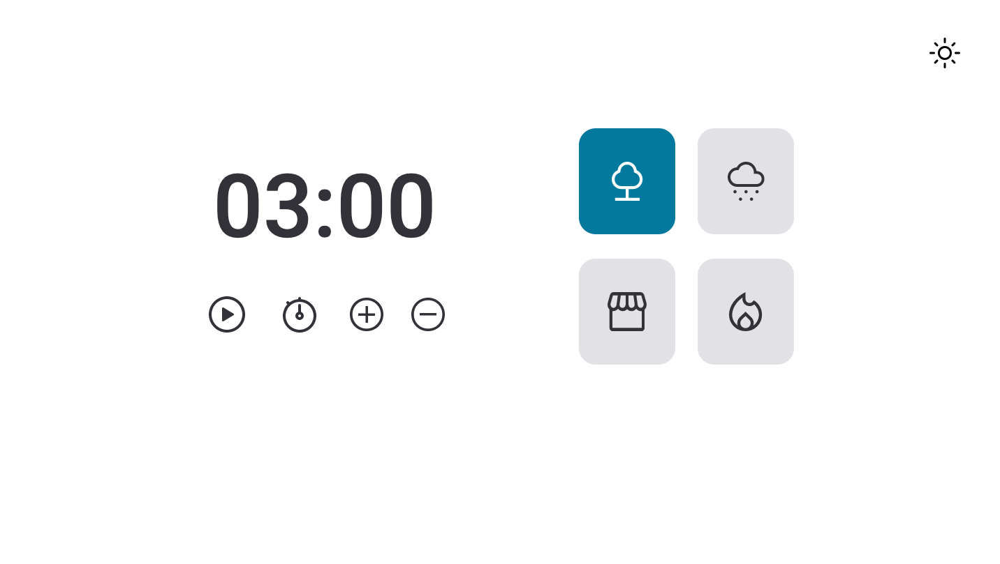
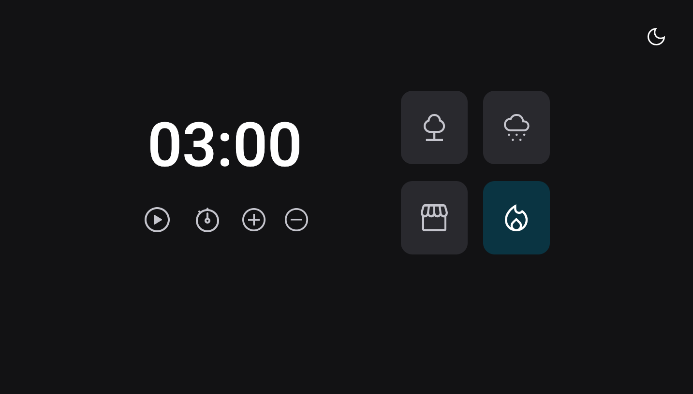

<h1 align="center">
  Focus Timer 2.0 ⏰
</h1>

  <a href="#-tecnologias">Tecnologias</a>&nbsp;&nbsp;&nbsp;|&nbsp;&nbsp;&nbsp;
  <a href="#-projeto">Projeto</a>&nbsp;&nbsp;&nbsp;|&nbsp;&nbsp;&nbsp;
  <a href="#-link">Link</a>&nbsp;&nbsp;&nbsp;|&nbsp;&nbsp;&nbsp;
  <a href="#-layout">Layout</a>&nbsp;&nbsp;&nbsp;|&nbsp;&nbsp;&nbsp;
  <a href="#memo-licença">Licença</a>

  
  

## 🚀 Tecnologias

Esse projeto foi desenvolvido com as seguintes tecnologias:

- HTML
- CSS
- JavaScript

## 💻 Projeto

Aplicação desenvolvida para auxiliar nos estudos como um timer, ajudando na utilização do método pomodoro de estudo. Após setar o temporizador a contagem regressiva inicia e ao zerar o cronômetro toca um alerme de aviso.
É possível adicionar e subtrair 5 minutos do temporizador utilizando os botões de + e -.
Foi inserida na aplicação uma sons ambiente que podem ser escolhidos conforme preferência e mutados, caso desejado.

## 🔗 Link
[Acesse aqui](https://alanrehfeldt.github.io/ExplorerStage05-Timer2.0/)

## 🔖 Layout

Você pode visualizar o layout do projeto através [desse link](https://www.figma.com/file/uAhzPyKmAuAtdzn9exkFUH/Stage-05---Dark-Mode-FocusTimer-(Copy)?node-id=0%3A1&t=Y423nJInjU8eJ7r2-0). É necessário ter conta no [Figma](https://figma.com) para acessá-lo.

## :memo: Licença

Esse projeto está sob a licença MIT. Veja o arquivo [LICENSE](LICENSE.md) para mais detalhes.

---

Feito por Alan Rehfeldt :wave: 
